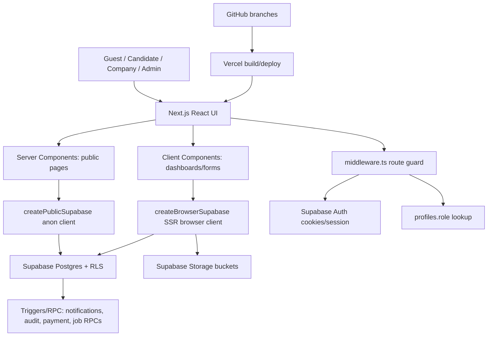
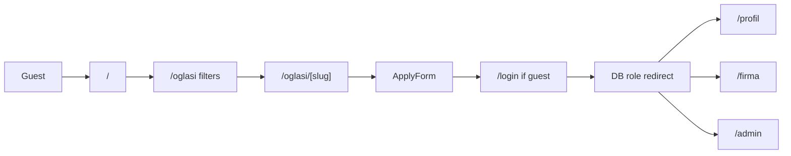
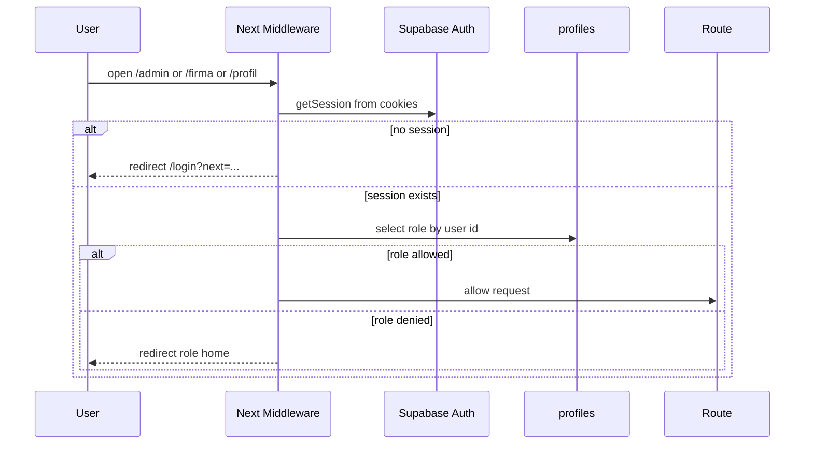
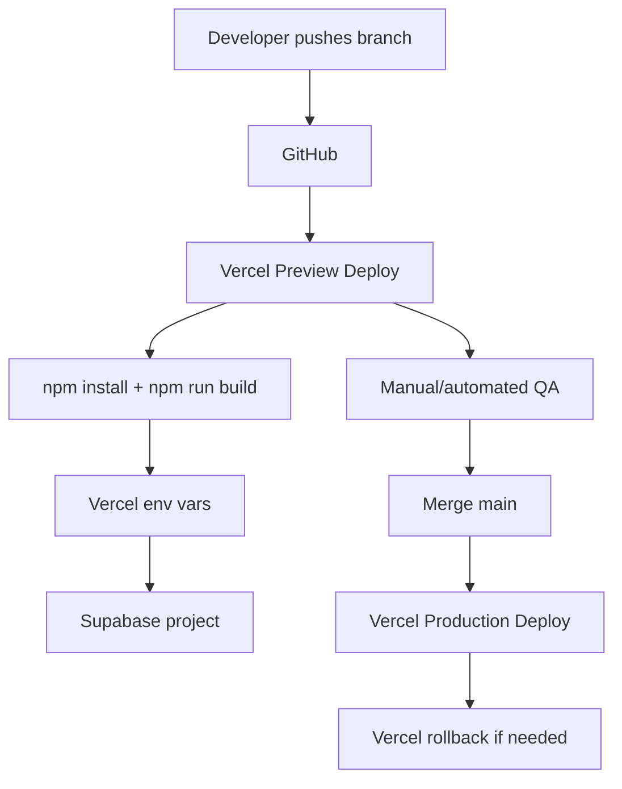

# imaposla.me - Complete Technical & Functional Audit

Date: 2026-05-18  
Scope: source code in this folder only. Live Supabase/Vercel/GitHub configuration was not queried, so production state must be verified against dashboards.  
Audience: new development team, product owner, QA, DevOps.

## 1. Executive Summary

`imaposla.me` is a Next.js App Router platform for jobs in Montenegro. It connects guests, candidates, companies/employers and admins. The product covers public job discovery, candidate CV/profile management, applications, employer dashboards, ATS-style candidate selection, subscriptions/payment proofs, banners/ads, promoted jobs, recommended employers and admin moderation.

Architecture is a lean Next.js + React + Supabase system:
- Frontend: Next.js 15.3.6, React 19, TypeScript, global CSS design system.
- Backend: Supabase Auth, Postgres, RLS, Storage, SQL RPC functions/triggers.
- Deployment target: Vercel-style Next deployment. Netlify was discussed earlier, but this codebase is configured as a standard Next/Vercel app.
- Auth: Supabase browser client plus SSR middleware route protection.
- Data access: server-side public Supabase client for public pages, browser Supabase client for authenticated dashboards/actions.

Current readiness: strong MVP/beta with a broad feature set. Not yet fully production-hardened until live Supabase RLS/migrations/env/email/storage are verified. The largest risks are database migration drift, client-side admin actions relying on RLS, Next.js version security warning, missing automated tests, and duplicated/legacy SQL files. Encoding was re-checked through Node UTF-8 reads after this audit; no mojibake was found in source files outside this audit document.

Top 5 immediate fixes:
1. Upgrade Next.js from `15.3.6` to a patched version.
2. Run canonical SQL migrations on staging and compare actual tables/RLS/RPC with `MIGRATIONS.md`.
3. Move privileged admin mutations to server actions/API routes or RPC functions where appropriate.
4. Add automated E2E tests for auth, apply flow, ATS, admin approval, subscription/payment proof and banner flow.
5. Keep encoding scan in CI/release checklist so terminal display issues do not turn into source-file regressions.

## 2. Architecture Overview

## 3. Stack, Build, Runtime

| Area | Implementation | Notes / Risks |
|---|---|---|
| Framework | Next.js App Router `15.3.6` | npm warns this version has a security vulnerability; upgrade required. |
| Language | TypeScript + React 19 | Typecheck passes. |
| Styling | `app/globals.css` global system | Very large file; includes legacy styles plus brandbook overrides. Refactor later. |
| Auth | Supabase Auth | Browser session + middleware session. |
| DB | Supabase Postgres | Heavy RLS dependence. Must verify real DB state. |
| Storage | Supabase Storage | Buckets: `avatars`, `company-logos`, `banners`, `payment-proofs`. |
| API routes | `/auth/login`, `/auth/logout`, `/og-image` | Most mutations happen directly from client to Supabase. |
| State | Local React state and Supabase session context | No Redux/Zustand; okay for current size but complex dashboards are state-heavy. |
| Build | `npm run build` | Passes with valid/dummy env. Without env, config intentionally throws. |
| Env | `NEXT_PUBLIC_SUPABASE_URL`, `NEXT_PUBLIC_SUPABASE_ANON_KEY` | Required in all deploy environments. |

Verification run:
- `npm install`: passed.
- `npm run typecheck`: passed.
- `npm run lint`: passed.
- `npm run build`: passed with dummy Supabase env; expected `fetch failed` logs because dummy URL has no real DB.

## 4. Folder Structure Audit

| Folder | Purpose | Dependency chain | Status |
|---|---|---|---|
| `app/` | App Router pages, layouts and route handlers. | Imports UI components and query functions. Public pages use server query functions; protected pages mount client dashboards. | Active. |
| `components/` | All reusable and route-specific React components. | Imports auth context, Supabase browser client, domain types, navigation helpers. | Active, but large components should be split. |
| `lib/` | Auth context, Supabase clients, query helpers, formatting, navigation, constants. | Used by almost all pages/components. | Active. |
| `lib/queries/` | Public and account query wrappers. | Public functions use server anon client; account functions use browser client. | Active. |
| `lib/supabase/` | Supabase config and client factories. | Depends on env vars. | Active. |
| `types/` | Domain TypeScript types. | Imported broadly. | Active but not generated from DB, can drift. |
| `public/` | Static assets/OG SVG. | Used by metadata/share fallback. | Active. |
| `legacy-static/` | Old static prototype. | Not used by Next runtime. | Legacy/reference only. |
| root SQL files | Supabase schema/migrations/RLS/RPC/storage. | Must be applied manually in Supabase SQL editor. | Active + legacy mixed; canonical order is in `MIGRATIONS.md`. |
| root docs | README, deployment guide, checklist, reports. | Human docs only. | Encoding re-check passed; migration-order notes still need live confirmation. |

There is no `hooks/`, `utils/`, `api/` or `supabase/` directory; equivalent logic is in `lib/`, App Router route handlers and root SQL files.

## 5. Route Map

| Route | File | Type | Main component/data | Access |
|---|---|---|---|---|
| `/` | `app/page.tsx` | public | `getHomepageData`, `getLookups`, `getActiveBanners`, job cards, premium employers | everyone |
| `/oglasi` | `app/oglasi/page.tsx` | public | `getPublicJobs`, filters, tower/banner slots | everyone |
| `/oglasi/[slug]` | `app/oglasi/[slug]/page.tsx` | public + candidate action | `getJobById`, `ApplyForm`, `JobViewTracker` | everyone; apply requires candidate |
| `/firme` | `app/firme/page.tsx` | public | `getCompanies`, `CompanyCard` | everyone |
| `/firme/[slug]` | `app/firme/[slug]/page.tsx` | public | company profile + active jobs | everyone |
| `/gradovi`, `/gradovi/[grad]` | app files | public SEO | city lookup/jobs | everyone |
| `/kategorije`, `/kategorije/[kategorija]` | app files | public SEO | category lookup/jobs | everyone |
| `/za-firme` | `app/za-firme/page.tsx` | public marketing/product | static cards/CTA | everyone |
| `/login` | `app/login/page.tsx` | auth | `LoginForm`, `RedirectIfAuthed` | guests; logged-in redirected |
| `/registracija` | `app/registracija/page.tsx` | auth | `RegisterForm` role candidate/company | guests; logged-in redirected |
| `/zaboravljena-lozinka` | app file | auth recovery | reset email form | guests |
| `/reset-lozinka` | app file | auth recovery | token/session verification + update password | guests/auth recovery |
| `/logout` | `app/logout/page.tsx` | auth | `LogoutClient` signOut | logged-in mainly |
| `/profil` | app file | candidate dashboard | `DashboardClient` | candidate/admin via middleware |
| `/profil/biografija` | app file | candidate | `CvBuilder` | candidate/admin |
| `/profil/prijave` | app file | candidate | `ApplicationsClient` | candidate/admin |
| `/profil/sacuvani` | app file | candidate | `SavedJobsClient` | candidate/admin |
| `/profil/sacuvano` | app file | redirect alias | redirects to `/profil/sacuvani` | candidate/admin |
| `/profil/upozorenja` | app file | candidate | `JobAlertsClient` | candidate/admin |
| `/firma` | app file | company dashboard | `CompanyClient dashboard` | company/admin |
| `/firma/oglasi` | app file | company | `CompanyClient jobs` | company/admin |
| `/firma/novi-oglas` | app file | company | `CompanyClient new-job` | company/admin |
| `/firma/pretplata` | app file | company | `CompanyClient billing` | company/admin |
| `/firma/kandidati` | app file | company | `CvUnlockClient` | company/admin |
| `/firma/baneri` | app file | company | `BannerRequestClient` | company/admin |
| `/firma/selekcija` | app file | company ATS | `AtsClient` | company/admin |
| `/admin` | app file | admin dashboard | `AdminClient dashboard` | admin only |
| `/admin/oglasi` | app file | admin | `AdminClient jobs` | admin |
| `/admin/firme` | app file | admin | `AdminClient companies` | admin |
| `/admin/korisnici` | app file | admin | `AdminClient users` | admin |
| `/admin/uplate` | app file | admin | `AdminClient payments` | admin |
| `/admin/paketi` | app file | admin | `AdminPaketiClient` | admin |
| `/admin/baneri` | app file | admin | `AdminBannersClient` | admin |
| `/admin/banner-zahtjevi` | app file | admin | `AdminBannerRequestsClient` | admin |
| `/admin/templates` | app file | admin | `AdminTemplatesClient` | admin |
| `/admin/audit-log` | app file | admin | `AdminAuditLogClient` | admin |
| `/auth/login` | route handler | auth callback | exchanges auth code then redirects | Supabase redirect |
| `/auth/logout` | route handler | logout | signs out server-side | users |
| `/og-image` | route handler | dynamic SVG/PNG OG | title/subtitle query params | public |
| `/robots.txt`, `/sitemap.xml` | app metadata routes | SEO | public routes + dynamic jobs/companies | public |

## 6. File Structure Audit

### Root/config/docs

| File | Purpose | Active/legacy | Risks |
|---|---|---|---|
| `package.json`, `package-lock.json` | dependency and script definitions. | Active | Next version security warning. |
| `next.config.ts` | security headers, image remote patterns, cache headers. | Active | CSP missing; `picsum` dev-only is okay. |
| `middleware.ts` | server-side role route guard. | Active | one DB role lookup per protected request; fail-closed on DB error. |
| `.env.example` | required Supabase env documentation. | Active | service role is comment-only; verify all production envs manually. |
| `README.md`, `DEPLOYMENT-VODIC.md`, `PRODUCTION_CHECKLIST.md`, `MIGRATIONS.md` | onboarding/deploy/migration docs. | Active docs | docs disagree slightly on migration order; encoding re-check passed. |
| `BRANDBOOK_REDESIGN_REPORT.md` | visual redesign report. | Active documentation | good context for UI. |
| `AUDIT_INVENTORY.json` | generated inventory from this audit. | Temporary/helper | can keep for dev handoff or remove before production. |
| `tsconfig.json`, `eslint.config.mjs`, `next-env.d.ts` | TS/lint config. | Active | no test config. |

### App files

| File/group | Purpose | Imports/exports | Problems |
|---|---|---|---|
| `app/layout.tsx` | root metadata, global CSS, `Header`, `Footer`, `MobileNav`, `AuthProvider`. | exports `metadata`, `viewport`, default layout. | all client auth context wraps full app. |
| `app/page.tsx` | homepage: intent switch, search, premium employers, jobs, banners. | imports public queries and UI components. | depends on many DB tables; empty states mostly present. |
| `app/globals.css` | full UI system, brandbook overrides, responsive fixes. | CSS only. | huge/duplicated; old styles + overrides; should be modularized. |
| `app/error.tsx`, `loading.tsx`, `not-found.tsx` | global error/loading/not-found. | simple components. | fine. |
| public page groups | `/oglasi`, `/firme`, `/gradovi`, `/kategorije`, legal pages. | server components + query functions. | search uses FTS fallback; no pagination. |
| auth pages | `/login`, `/registracija`, `/zaboravljena-lozinka`, `/reset-lozinka`, `/logout`. | client auth forms. | source encoding re-check passed; still needs manual visual QA. |
| protected candidate pages | `/profil/**`. | thin wrappers around client components. | client components still guard; middleware protects first. |
| protected company pages | `/firma/**`. | thin wrappers around company/ATS/banner/CV components. | multiple company ownership currently picks first company. |
| protected admin pages | `/admin/**`. | thin wrappers around admin clients. | admin mutations are browser-side RLS-dependent. |
| route handlers | `/auth/login`, `/auth/logout`, `/og-image`. | server-side auth/OG. | config throws if env missing at build/import. |

### Components

| Component | Role | Data/API coupling | Status / notes |
|---|---|---|---|
| `auth-form.tsx` | login/register forms. | `supabase.auth.signInWithPassword`, `signUp`, `profiles.role`. | active; role comes from URL/prop. |
| `redirect-if-authed.tsx` | redirects logged-in auth pages. | `useAuth`, `roleHomes`. | active; mitigates double-login view. |
| `logout-client.tsx` | client signOut and redirect. | `auth.signOut`. | active. |
| `dashboard-client.tsx` | candidate dashboard. | profile/applications/saved counts. | active. |
| `cv-builder.tsx` | candidate CV editor/preview/export. | `profiles.cv_data`, avatar upload. | active; PDF export is print/browser-based. |
| `applications-client.tsx` | candidate application history. | `job_applications` with job/company joins. | active. |
| `saved-jobs-client.tsx`, `save-job-button.tsx` | saved jobs list/toggle. | `saved_jobs`. | active; duplicate insert handled. |
| `job-alerts-client.tsx` | alert CRUD. | `job_alerts`, `cities`, `categories`. | active; email alert delivery is not implemented, in-app only. |
| `company-client.tsx` | company profile, jobs, billing, orders. | `companies`, `jobs`, `job_applications`, `orders`, `plans`, storage, RPCs. | active but too large; first-company assumption. |
| `ats-client.tsx` | ATS board/list/detail. | `companies`, `jobs`, `job_applications`, labels/comments/events. | active; key screen; comments/labels depend on migrations. |
| `ats-detail-panel.tsx` | candidate detail, comments/labels. | application comments/labels/profile info. | active. |
| `cv-unlock-client.tsx` | company candidate search and CV unlock. | `company_cv_unlocks`, credits, profiles public fields. | active; backend/RPC must be verified. |
| `banner-request-client.tsx` | company banner request. | `banner_requests`, storage `banners`. | active. |
| `admin-client.tsx` | admin dashboard/jobs/users/firms/payments. | many tables, storage signed URLs, `confirm_payment_proof`. | active but large and browser-side privileged. |
| `admin-paketi-client.tsx` | plan CRUD. | `plans`. | active. |
| `admin-banners-client.tsx` | banner CRUD. | `banners`, storage. | active. |
| `admin-banner-requests-client.tsx` | approve/reject banner requests. | `banner_requests`, `banners`. | active. |
| `admin-templates-client.tsx` | creative template CRUD. | `creative_templates`. | active. |
| `admin-audit-log-client.tsx` | audit log viewer. | `admin_audit_log` / RPC depending implementation. | active if migration applied. |
| `admin-promote-modal.tsx` | job promotion modal. | `job_promotions`. | active. |
| `apply-form.tsx` | candidate applies to job. | `job_applications`, `profiles`, `notifications`. | active; notification insert best-effort. |
| `job-card.tsx`, `job-card-compact.tsx` | public job cards. | presentational + save button. | active. |
| `company-card.tsx`, `recommended-companies.tsx`, `premium-employers.tsx` | employer display. | presentational. | active. |
| `banner-slot.tsx`, `tower-banner.tsx`, `hero-banner-carousel.tsx`, `banner-click-tracker.tsx` | banner rendering/tracking. | `banners`, `increment_banner_click` maybe. | active; impressions may need verification. |
| `image-upload.tsx`, `avatar.tsx` | image upload/public URLs. | Supabase Storage. | active; SVG blocked in current component. |
| `notification-bell.tsx`, `notification-center.tsx` | notifications UI. | `notifications`. | active; polling/client fetch, not realtime. |
| `header.tsx`, `footer.tsx`, `mobile-nav.tsx`, `ui.tsx`, `mobile-filter-drawer.tsx` | layout/navigation/UI primitives. | auth context/navigation helpers. | active. |

### Lib/types/public

| File | Purpose | Notes |
|---|---|---|
| `lib/supabase/config.ts` | reads env and throws if missing. | good for safety; build requires env. |
| `lib/supabase/client.ts` | singleton browser Supabase client. | active. |
| `lib/supabase/server.ts` | public anon client with no session persistence. | used by server components. |
| `lib/auth-context.tsx` | client role/session state. | authoritative DB role; has fallback upsert candidate if profile missing. |
| `lib/auth-role.ts` | role normalization/load helper. | does not trust metadata. |
| `lib/queries/public.ts` | public jobs/companies/lookups/plans/homepage. | server-side anon queries; fallback when FTS missing. |
| `lib/queries/account.ts` | saved jobs, alerts, notifications, active plan, job views. | browser client. |
| `lib/queries/banners.ts` | active/admin banner queries. | public client; admin all banners via anon/RLS. |
| `lib/navigation.ts`, `labels.ts`, `format.ts`, `errors.ts`, `banner-constants.ts` | helpers/constants. | active. |
| `lib/mock-banners.ts` | dev-only fallback banners. | ensure not production-visible. |
| `types/domain.ts` | shared domain types. | active; manually maintained and can drift from SQL. |
| `public/og-default.png.svg` | default OG asset. | active. |

### Legacy

`legacy-static/` contains an old static prototype (`index.html`, `app.js`, `styles.css`, README). It is not the Next entrypoint and should not be deployed as production. Keep as reference or archive outside production repo.

## 7. User Flow Documentation

### Guest

Sees homepage, employer carousel, search, public jobs, job detail, companies, city/category SEO pages, legal pages, login/register. Can search/filter/view but cannot apply or save. Clicking apply shows login/register prompt from `ApplyForm`.

Flow: enter `/` -> choose `Tražim posao` or search -> `/oglasi` -> `/oglasi/[slug]` -> apply -> login/register -> candidate profile.

Edge cases: empty DB shows empty states; missing Supabase env breaks app at import; FTS missing falls back to non-filtered active jobs; no pagination for large job count.

### Candidate

Registration via `/registracija?role=candidate`; login redirects to `/profil` unless `next` is safe. Candidate can edit CV/profile, upload avatar, apply to jobs, view application status, save jobs, manage alerts, see notifications.

Queries: `profiles`, `job_applications`, `saved_jobs`, `job_alerts`, `notifications`, `job_views`.

Edge cases: duplicate apply is checked client-side and should also be DB-unique; if CV/profile is empty apply blocks; if profile trigger fails AuthContext inserts candidate profile.

### Company / Employer

Registration via `/registracija?role=company`; login redirects to `/firma`. Company creates/edits profile, waits approval, creates jobs after approval, manages jobs, sees applications, uses ATS, orders plans, uploads payment proof, sends banner requests, searches/unlocks candidate CVs.

Queries/RPC: `companies`, `jobs`, `job_applications`, `orders`, `payment_proofs`, `plans`, `company_active_plan`, `company_pause_job`, `company_submit_for_review`, `company_delete_job`, storage `payment-proofs`, `company-logos`.

Edge cases: owner can have multiple companies but UI uses the first; job actions depend on RPC presence; company approval is boolean only; pending state is shown but must be verified with real data.

### Admin

Admin role is `profiles.role='admin'`. Admin sees `/admin` dashboard and can moderate jobs, companies, users, payments, plans, banners, banner requests, templates and audit log.

Queries/RPC: broad reads/writes across `profiles`, `jobs`, `companies`, `payment_proofs`, `orders`, `plans`, `banners`, `banner_requests`, `creative_templates`, `admin_audit_log`, `confirm_payment_proof`, storage signed URL.

Edge cases: most admin work is client-side Supabase calls, protected by middleware and RLS. Stronger architecture would move critical operations to RPC/server actions with server-side validation.

### Super Admin

No distinct `superadmin` role exists in TypeScript roles, middleware or UI. Only `guest`, `candidate`, `company`, `admin` are defined. Any “super admin” concept would need a new role, RLS policies, middleware updates, UI permissions and migration.

## 8. Authentication & Security Audit

Auth model:
- Login form uses `signInWithPassword`.
- Register form uses `signUp` with metadata role.
- DB trigger in SQL should create `profiles` row.
- Frontend does not trust metadata for access; it reads `profiles.role`.
- Middleware protects `/admin`, `/firma`, `/profil`.
- Already-authenticated users are redirected away from `/login` and `/registracija`.
- Reset password uses Supabase recovery token/session and `auth.updateUser`.
- Logout uses both route and client component patterns.

Important findings:

| Severity | Finding | Location | Impact | Fix |
|---|---|---|---|---|
| High | Next.js version has security warning. | `package.json` | Known framework vulnerability. | Upgrade Next to patched version; run full QA. |
| Medium | Critical admin actions are browser-side with anon key/RLS. | admin components | RLS must be perfect; harder audit trail and validation. | Move to RPC/server actions for role change, approve, delete, confirm payment. |
| Medium | Middleware uses `getSession`; Supabase recommends `getUser` for server validation in some contexts. | `middleware.ts` | Session may be cookie-derived; role DB check mitigates. | Consider `getUser()` for stronger auth validation if latency acceptable. |
| Medium | Config throws on missing env at import. | `lib/supabase/config.ts` | Build/dev fails unless env exists. | Keep for prod safety; document dummy env for CI or improve build-time guard. |
| Medium | CSP header was missing. | `next.config.ts` | XSS mitigation incomplete. | `Content-Security-Policy-Report-Only` added; monitor, then enforce. |
| Low | No rate limiting/spam prevention in app code. | auth/apply/banner/contact-like flows | Abuse risk. | Supabase/email captcha/rate limit or edge middleware. |

## 9. Supabase & Database Audit

Tables inferred from SQL/types/code:
`profiles`, `candidate_profiles`, `companies`, `categories`, `cities`, `jobs`, `job_applications`, `ats_comments`, `application_events`, `application_comments`, `application_labels`, `plans`, `orders`, `subscriptions`, `payment_proofs`, `banners`, `notifications`, `saved_jobs`, `job_alerts`, `job_views`, `job_promotions`, `company_cv_unlocks`, `credit_transactions`, `banner_requests`, `worker_ratings`, `creative_templates`, `admin_audit_log`.

Core relationships:
- `profiles.id` -> `auth.users.id`.
- `companies.owner_id` -> `profiles.id`.
- `jobs.company_id` -> `companies.id`; optional `category_id`, `city_id`.
- `job_applications.job_id` -> `jobs.id`; `candidate_id` -> `profiles.id`.
- `application_comments/labels/events` -> `job_applications.id`.
- `orders.company_id` -> `companies.id`; `plan_id` -> `plans.id`.
- `payment_proofs.order_id` -> `orders.id`, `company_id` -> `companies.id`.
- `subscriptions.company_id` -> `companies.id`, `plan_id` -> `plans.id`.
- `banners.company_id` optional -> `companies.id`.
- growth tables support promotions, CV unlock credits, banner requests, worker ratings and creative templates.

RPC/functions used or expected:
- `company_active_plan`
- `company_pause_job`
- `company_submit_for_review`
- `company_delete_job`
- `confirm_payment_proof`
- `increment_banner_click`
- `spend_company_credits`
- `add_company_credits`
- `get_company_credit_balance`
- `expire_job_promotions`
- `expire_old_jobs`
- `is_admin`, `current_user_role`, ownership helper functions.

Storage:
- `avatars` public.
- `company-logos` public.
- `banners` public.
- `payment-proofs` private/signed URL.

Migration risk: there are many overlapping SQL files (`supabase-schema`, `production`, `auth-complete`, `security-fixes`, `rls-fix`, `production-fixes`, `final`, etc.). `MIGRATIONS.md` defines canonical order and marks `supabase-final.sql` and seed data as not for production, but live DB must be compared. This is the biggest backend handoff risk.

Query risks:
- Public queries have no pagination; `/oglasi` limits 100.
- `getHomepageData` joins `job_promotions` and falls back only when no promoted rows; if migration missing, sections become empty but build continues with errors logged.
- Company dashboard fetches `profiles(cv_data)` for applications. That is intended for applicant/company relation but verify RLS prevents other companies reading.
- Candidate CV unlock search intentionally excludes `cv_data` in bulk list; good.
- `job_views` insert is best-effort and unbounded; add aggregation/retention later.

## 10. API & Integration Audit

API routes:
- `GET /auth/login`: exchanges Supabase auth callback code/session and redirects.
- `GET /auth/logout`: server-side logout.
- `GET /og-image`: dynamic OG image.
- metadata routes `/robots.txt`, `/sitemap.xml`.

No Axios. `fetch` appears through Next/Supabase internals rather than custom REST APIs. The app talks directly to Supabase from components/query files. Webhooks are not implemented in code. Email is Supabase Auth templates only.

Integration gaps:
- No Stripe/payment gateway; subscription payment is manual bank/payment proof upload.
- No email job alerts sender; job alerts are stored/in-app only.
- No realtime notification subscription; polling/client fetch only.
- No external analytics except custom `job_views` and banner counters.

## 11. Jobs / Applications / ATS Audit

Job lifecycle:
1. Company creates job in `/firma/novi-oglas`.
2. Job inserted as `pending_review`, `featured=false`.
3. Admin approves by setting `status='active'`.
4. Public pages read only active jobs.
5. Candidate applies from job detail.
6. Application row appears in candidate history and company ATS if RLS and joins are correct.
7. Company can move application stage in ATS and use labels/comments if migrations exist.

Specific requested checks:
- “Prijava stigne ali nema u selekciji”: likely causes are RLS policy mismatch, `jobs!inner` join filter, company first-company assumption, application inserted for inactive/wrong job, or missing `job_applications` policies. Test with real company/job IDs.
- “Firma bude odobrena ali status nije vidljiv”: `CompanyClient.load()` reloads company after update; admin notification best-effort. If user session role is still company and company row approved true, dashboard should show approved. Test RLS and cache.
- Featured/top jobs: dual system exists: legacy `jobs.featured` and new `job_promotions`. Admin can toggle `featured` and open promotion modal. Homepage prefers `job_promotions`.
- Sticky/premium jobs: `job_promotions` supports priority, type, starts/ends.
- Desktop 2-column layout: `job-list two-col` CSS used; mobile handled globally.

## 12. Admin Panel Audit

Admin has:
- Dashboard stats: pending jobs, pending companies, pending payments, users, revenue.
- Jobs: approve/pause/delete/feature/promote/preview.
- Companies: approve/hide/recommend.
- Users: change role, reset password email.
- Payments: open proof signed URL, confirm via RPC, reject.
- Plans/packages CRUD.
- Banners CRUD.
- Banner request approval.
- Creative templates CRUD.
- Audit log.

Risks:
- Browser-side role changes and deletes should become RPC/server actions.
- Role change prevents self-demotion in UI plus SQL trigger expected; verify live DB trigger.
- Admin card list is convenient but not true data table; large datasets need pagination/server filtering.
- Revenue sums all paid orders in browser, not paginated; okay for small MVP, bad at scale.

## 13. UI/UX Audit

Strengths:
- Brandbook navy/red system applied.
- Homepage now has clear `Nudim posao` / `Tražim posao`, search, premium employers, jobs.
- Empty states exist across major flows.
- Mobile nav exists.
- Forms generally have labels/loading/errors.

Risks:
- `app/globals.css` is 140k+ and layered; future edits can regress.
- Encoding scan passed in source; keep manual visual QA because terminals can display UTF-8 incorrectly.
- Many icons are emoji/text, not consistent line icons.
- Some inline styles remain.
- No automated visual regression testing.
- Admin on mobile is improved but still dense; true admin mobile UX needs QA with real long data.
- No skeletons beyond simple loading panels.

## 14. SEO & Performance Audit

SEO present:
- Metadata in root layout and pages.
- Dynamic sitemap includes jobs/companies/lookups.
- Robots file exists.
- OG route exists.
- Public SEO routes by city/category/company/job.

Missing/improve:
- Canonical URLs not explicit per page.
- No schema.org JobPosting markup.
- No pagination for job listing SEO.
- No `next/image` optimization usage; plain images are used.
- Large global CSS and client components increase payload/maintenance risk.
- Public Supabase calls at build/revalidate can log failures when DB unavailable; acceptable but noisy.

Performance:
- Build shared JS about 101k from previous build output.
- Public pages server-render/revalidate.
- Client dashboards fetch after mount; could use server prefetch later.
- Indexes exist in performance SQL, but live DB must be verified.

## 15. Banner & Monetization Audit

Systems present:
- `banners` table with placement, format, audience, device, approved, priority, start/end, impressions/clicks.
- Banner render components: `BannerSlot`, `TowerBanner`, `HeroBannerCarousel`.
- Company banner request flow.
- Admin banner CRUD and request approval.
- Promoted jobs via `job_promotions`.
- Recommended companies via `companies.recommended`.
- Plans/subscriptions/payment proofs.

Recommended placements:
- Homepage top after search/premium employers.
- Homepage middle between highlighted jobs and newest jobs.
- Job list top/middle/bottom.
- Job detail top/bottom.
- Desktop side tower on job list.
- Company pages top/bottom.

Tracking recommendation: use RPC for clicks/impressions, debounce impression client-side and consider daily aggregation.

## 16. Deployment & Infrastructure

Expected flow:
1. Branch pushed to GitHub.
2. Vercel creates preview deploy.
3. Env vars must exist in preview/production.
4. Build runs `npm install` and `npm run build`.
5. Supabase migrations must already be applied.
6. Merge to main triggers production deploy.

Production env checklist:
- `NEXT_PUBLIC_SUPABASE_URL`
- `NEXT_PUBLIC_SUPABASE_ANON_KEY`
- Supabase Auth Site URL and redirect URLs.
- Email templates installed.
- Storage buckets/policies verified.
- Admin account role set.

Rollback: use Vercel deploy rollback; DB migrations are not automatically rolled back, so migration releases need manual rollback plan.

## 17. Bug & Risk Report

| Severity | Bug/Risk | Where | Reproduce | Fix |
|---|---|---|---|---|
| High | Next.js vulnerable version warning. | `package.json` | `npm install`. | upgrade Next. |
| High | Migration drift risk. | root SQL files | compare live DB to canonical order. | consolidate migrations; make one migration folder. |
| High | Admin privileged browser mutations. | `AdminClient`, admin CRUD components | inspect network in admin actions. | server actions/RPC-only mutation layer. |
| Medium | Multiple company ownership unsupported in UI. | `CompanyClient` | owner has 2 companies. | add company switcher and scoped routing. |
| Medium | No pagination/server filtering in admin/list pages. | admin/jobs/public jobs | large dataset. | add pagination and query params. |
| Medium | No automated E2E/visual tests. | repo | none present. | Playwright/Cypress suite. |
| Medium | Job alerts email not implemented. | `JobAlertsClient`, SQL | create alert, no email. | Edge Function/Cron. |
| Medium | Worker ratings DB only. | SQL/types | no UI. | mark future or build UI. |
| Medium | Public query fallback can ignore search if FTS missing. | `getPublicJobs` | remove `fts` column. | better fallback with ilike title/company. |
| Low | `AUDIT_INVENTORY.json` generated helper. | root | file exists after audit. | delete before deploy if unwanted. |
| Low | Legacy static code in repo. | `legacy-static/` | deploy scanners see it. | archive or exclude from production repo. |

## 18. Missing / Incomplete Features

- Superadmin role.
- Real payment provider and automated subscription activation.
- Email job alerts.
- Realtime notifications.
- Account deletion/data export/GDPR workflow.
- Public worker ratings UI.
- Full analytics dashboard.
- Company multi-profile switcher.
- Server-side admin action layer.
- Automated QA/visual regression.
- Structured JobPosting schema. Added after this audit in `app/oglasi/[slug]/page.tsx`.

## 19. Improvement Roadmap

### Quick wins

| Task | Priority | Effort | Impact |
|---|---|---|---|
| Upgrade Next patched version. | P0 | S/M | High |
| Remove/archive legacy/static and generated helper from deploy branch. | P1 | S | Medium |
| Add `schema.org JobPosting` to job detail. | Done | S | Medium |
| Add canonical links. | P1 | S | Medium |

### Medium improvements

| Task | Priority | Effort | Impact |
|---|---|---|---|
| Consolidate SQL migrations into `/supabase/migrations`. | P0 | M | Very high |
| Add Playwright tests for 4 roles. | P0 | M | Very high |
| Server-side admin RPC/action layer. | P0 | M/L | Very high |
| Add pagination/filter query state to admin and jobs. | P1 | M | High |
| Split `CompanyClient` and `AdminClient`. | P1 | M | High |

### Large architecture improvements

| Task | Priority | Effort | Impact |
|---|---|---|---|
| Generate TS types from Supabase schema. | P1 | L | High |
| Add email/cron job alert service. | P1 | L | High |
| Add observability/logging/analytics. | P1 | L | Medium/high |
| Add real payment gateway. | P2 | L | High business impact |
| Add multi-tenant company switcher. | P2 | M/L | Medium/high |

## 20. Final Recommendations

Treat the current project as a strong MVP/beta, not final production until live Supabase is audited. The frontend and product surface are broad and coherent, but production readiness depends on upgrading framework dependencies, hardening admin actions, verifying RLS/migrations, and adding automated tests.

Recommended first sprint:
1. Next upgrade.
2. Staging Supabase migration verification.
3. E2E tests for guest/candidate/company/admin.
4. Move payment confirmation, role change, job delete/approve to RPC/server actions.
5. Keep encoding scan in release checklist.

Recommended manual QA before launch:
- Guest: homepage, search, job detail, company pages.
- Candidate: register, email confirm, login, CV, apply, duplicate apply, saved jobs, alerts, logout.
- Company: register, create company, pending approval, admin approval, create job, admin job approval, ATS, plan order, proof upload, banner request.
- Admin: login, approve company/job, promote job, recommend company, confirm/reject payment, manage banners, change role, reset password, audit log.
